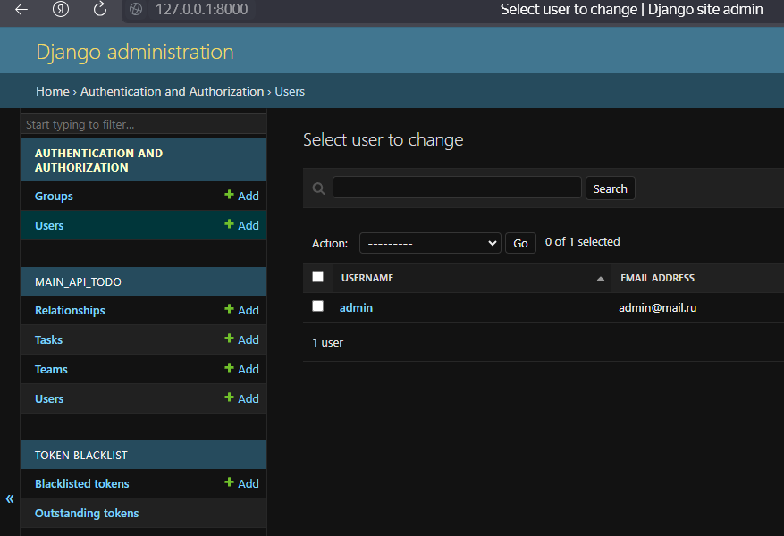

# Ты в моих владениях, склонись передо мной  

---
## Замечания
- [ ] [Dockerfile](./ToDoSite/.docker/Dockerfile) - посмотри отличие между командами RUN и CMD  
- [ ] Перенеси переменные окружения в .env файл - залог безопасности
- [ ] Сделай новую переменную с режимами: Dev и Prod
  - [ ] Dev - использует в качестве бд sqlite3
  - [ ] Prod - использует в качестве бд Postresql
- [ ] В [композе](./docker-compose.yml) сделай новый контейнер с Postresql
- [ ] Привести весь код к стандарту PEP8, удалить лишние комментарии встроенные от Django, удалить неиспользуемые файлы и тд.
- [ ] Если хочешь описать классы, функции или целые каталоги, то лучше использовать докстринг
- [ ] Модель пользователя должна наследоваться от абстрактной модели пользователя Django. Фреймвор под коркой у себя делает много вещей, которые тебе как программисту облегачат жизнь. В админ панеле видно, что в проекте 2 модели пользователя: 
- [ ] Аноним и вообще любой желающий может редактировать пользователя, это дело нужно проверять. Надо проверять есть ли доступ на изменение/просмотр информации
- [ ] Нет эндпоинтов login & logout
---

## Сделано  
- [x] Обернуть в Docker  
- [x] подключен swagger  
- [x] получение всех задач конкретной команды  
- [x] получение всех команд по id пользователя  
- [x] CRUD для всех основных сущностей
- [x] добавить авторизацию по JWT
- [x] автоматическое добавление автора в team как участника
- [x] ручка для добавления юзера в команду
- [x] получение всех участников команды   
- [x] получение всех команд в которых состоит участинк 

## Осталось  
- Все, привет фронт!

## Запуск Docker контейнера  
Для запуска проекта внутри докера использовать команду ```docker-compose up --build```  
  
<span style="color:red"> ВАЖНО: </span>  
  
- <span style="color:red"> Использовать VPN для коректной закачки докеробраза </span>  
- <span style="color:red"> Сервер отвечает только на конкретные адреса </span>  
  
  

